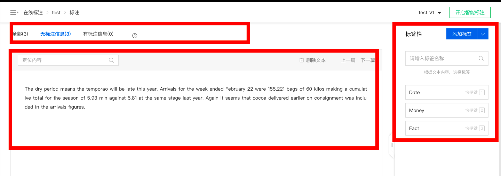
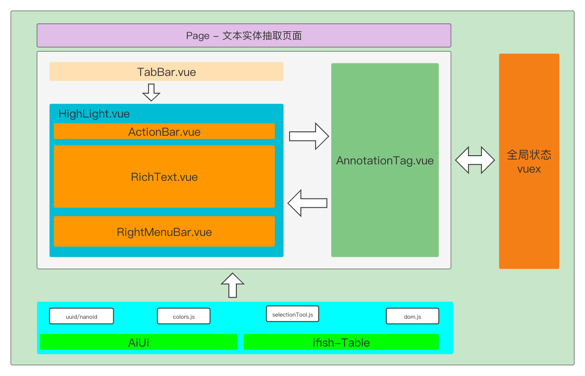
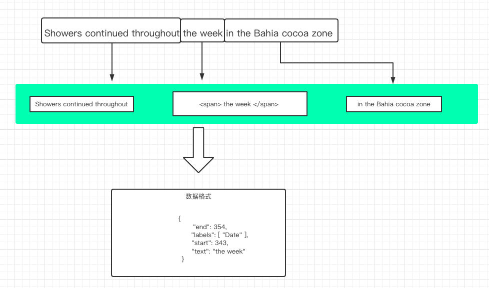
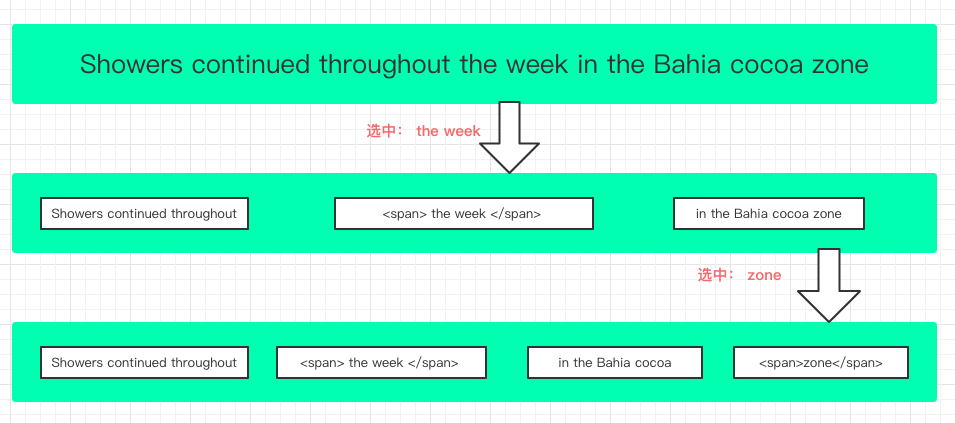
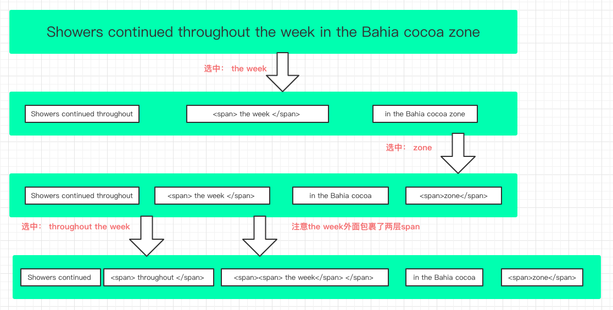

# 实体文本抽取前端页面设计

## 页面低保真


---
## 组件设计

主要分为三部分： 文本操作区 tabBar区 标注tag列表区


---
## 文本操作的实现流程

主要分为以下部分(暂不考虑边界情况)：

- 监听鼠标弹起事件mouseup
- 通过window.getSelection获取用户选择的selection对象
    - Selection 对象所对应的是用户所选择的 ranges （区域），俗称拖蓝
- 利用selection.getRangeAt(i)获取用户选中的是哪一个range（拖蓝）
    - Range.collapsed 只读 
      - 返回一个表示 Range 的起始位置和终止位置是否相同的布尔值 (en-US)。
    - Range.commonAncestorContainer 只读
      - 返回完整包含 startContainer 和 endContainer 的、最深一级的节点。
    - Range.endContainer 只读
      - 返回包含 Range 终点的节点。
    - Range.endOffset 只读
      - 返回一个表示 Range 终点在 endContainer 中的位置的数字。
    - Range.startContainer 只读
      - 返回包含 Range 开始的节点。
    - Range.startOffset 只读  
      - 返回一个表示 Range 起点在 startContainer 中的位置的数字。
- 把拖蓝的位置处理为特定的标签替换原来的文本



## 文本标签包裹实现 

分为两种情况：

### 拖蓝的部分是纯文本

  - 将文本截取为三部分：

      - 截取从0到range的startOffset的文本
      - 获取range里的文本，并包裹为固定的样式标签
      - 截取range的endOffset开始到文本结束
      - 将上面三段内容组装为一个节点替换原来的节点

  注意： 当Range的startContainer一定是一个dom节点意思是它可能是一个文本节点

```html
<div>
  Showers continued throughout the week in the Bahia cocoa zone
</div>

// dom tree
- element Node
  - text Node
```

而被切割之后是这样的
```html
<div>
  Showers continued throughout
  <span> the week </span>
  in the Bahia cocoa zone
</div>

// dom tree
- element Node <div>
  - Text Node（Showers continued throughout）
  - element Node <span> 
    - Text Node （the week）
  - Text Node （in the Bahia cocoa zone）
```

所以只要下次拖蓝没有选中span标签里的内容，一样适用于当前的分为三段规则

---
例如：选择了zone最后一个单词



选中zone后返回的Range对象的变化为：
- startContainer是包含zone的开始节点即Text Node（in the Bahia cocoa zone）
- endContainer也是这个Text Node（in the Bahia cocoa zone）
- 直接将当前这个Text Node的分割三段替换掉，如果没有前面或者后面没有文本就不加这个文本节点
- 而Text Node（in the Bahia cocoa zone）之前的节点不变动

---

### 拖蓝的部分包含标签

先看几个API

- [createTreeWalker api](https://developer.mozilla.org/zh-CN/docs/Web/API/Document/createTreeWalker)
- [TreeWalker对象](https://developer.mozilla.org/zh-CN/docs/Web/API/TreeWalker)
- [children 与 childrenNode](https://blog.csdn.net/weixin_40626699/article/details/86148142)

---

实现流程：

- 拖蓝之后会返回开始节点结束节点，以及包含开始节点与结束节点的最深的一级节点commonAncestorContainer
- 遍历commonAncestorContainer找到包含拖蓝部分的文字并替换为特定的标签

注意： 只操作文本节点



遍历流程
```js
// dom tree 原来的节点
- element Node <div>
  - Text Node（Showers continued throughout）
  - element Node <span> 
    - Text Node （the week）
  - Text Node （in the Bahia cocoa zone）

// 现在的节点 dom tree 
- element Node <div>
  - Text Node（Showers continued）
  - element Node
    - Text Node (throughout)
  - element Node <span> 
    - element Node <span>
      - Text Node （the week）
  - Text Node （in the Bahia cocoa zone）
```

### 数据回显方案